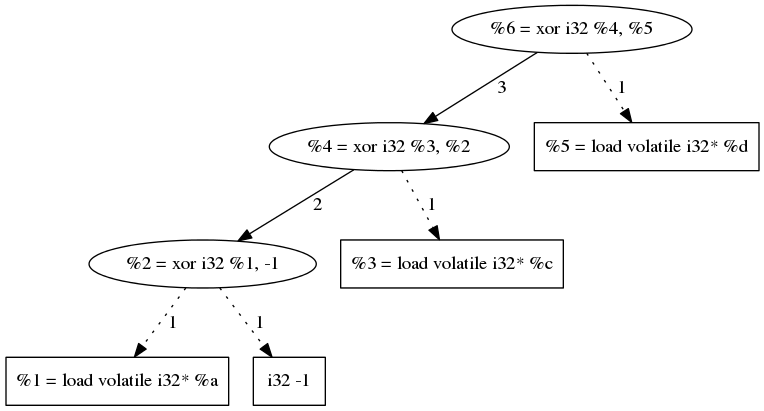

==========================================================
Turning Regular Code Into Atrocities With LLVM: The Return
==========================================================

Briefing
========

Required Background
*******************

This tutorial is the continuation of `this one <http://blog.quarkslab.com/turning-regular-code-into-atrocities-with-llvm.html>`_.
If you are not familiar with LLVM pass development you should read the previous tutorial, the basics won't be covered in this tutorial.

To go through the code samples given in this tutorial you will need to be able to read C, C++ code and simple LLVM bytecode.

Riddle
******

Let's start with a riddle.
The obfuscation we are going to implement will replace an operation `OP` by the sequence of instructions bellow.
Your job is to try to guess what `OP` is.

Given:

    * two operands `D` and `X` of same bitwidth
    * :math:`Y = D \text{ OP } X`
    * :math:`f: x = \sum x_i \cdot 2^i \mapsto x' = \sum x_i \cdot 3^i`
    * :math:`h: x = \sum x_i \cdot 3^i \mapsto x' = \sum (x_i \text{ mod } 2) \cdot 2^i`

We are going to rewrite the operation `OP` as follows:

    * Transform operands `D` and `X` with f:
        :math:`D'=f(D) \text{ and } X'=f(X)`
    * Apply the ADD operation to the new operands:
        :math:`A=D'+X'=\sum (d_i + x_i) \cdot 3^i`
    * Transform back the result with h:
        :math:`A'=h(A)=h(D'+X')`
    * And we magically obtain:
        :math:`h(D'+X')=D \text{ OP } X`

Don't cheat and try to find out what `OP` could be.

Obfuscation
***********

Ok for those of you who have guessed and the ones that skipped ahead the answer is `X-OR <http://le-monde-des-goodies.wifeo.com/images/x/xor/xor01.jpg>`_.

Oops, not that XOR, this one:

        =====  =====  =======
          A      B    A XOR B
        =====  =====  =======
          0      0       0
          0      1       1
          1      0       1
          1      1       0
        =====  =====  =======

The sequence of operations above (operands transformation, addition, result transformation) is a more complex, equivalent and harder to understand way to code a XOR.
If you want to make sure that's the transformation is not trivial, post in the comments whether you found the solution of the riddle; and if you did the time it took you.

We chose to obfuscate XORs because this operator is very present in cryptography and... because we all get bored sometimes...

But you shouldn't trust me. Taking a look at OpenSSL code base::
    `find $OPENSSL_SRC -name "*.c" -exec grep -cE " \^ " {} \; | awk '{s+=$1} END {print s}'`

we find around 648 XORs.

Behind the Scenes
*****************

Now, since programmers don't really deal in magic (at least not officially), let's try to understand what happened.
The first thing to understand is that a XOR operation is basically an ADD operation without carry.
This means that, if we have a representation of our operands in which the ADD carries won't propagate, then XOR and ADD are almost the same operand (in this representation).

And this is exactly what we have done.
The function `f` takes the base 2 coefficients (bits) of the operands and multiplies them by the corresponding power of 3.
You may have noticed that this operation is *almost* a change of basis operation from base 2 to base 3 in which the 'bits' are not transformed.

Since :math:`d_i \le 1 \text{ and } x_i \le 1` then :math:`a_i \le 2`.
This means that the bits of the sum of the new operands are never going to propagate to the other bits, since their sum is smaller than the 'basis' in which they are represented (here 3).

Because no carry has propagated it is trivial to rewrite the result of the sum as base, with a simple modulo on the bits.
This is what the function `h` does.
And the modulo behaviour is consistent with what a XOR operation does.

Bottom line by changing the representation of XOR operands we are able to guaranty that the equivalent ADD operation will not propagate carries.
Which means that in this new representation XORs ans ADDs are *almost* the same.
And a simple modulo takes care of this difference.

Requirements
============

Environment
***********

To use the passes we are going to develop, you will need LLVM and clang sources and to build them.
If you need details on how to get this you can refer to the 'Requirements' section of the `previous LLVM tutorial <http://blog.quarkslab.com/turning-regular-code-into-atrocities-with-llvm.html>`_.

To make sure that we all have the same basic project infrastructure you can checkout the corresponding git repository::

        >$ git clone https://github.com/quarkslab/llvm-passes

**In this article we are not going to explain every line of code, just the interesting parts. This is why you will need the git repository.**
At every step of the development you will be given the name of the branch holding the appropriate code state (we are going to develop the obfuscation in 3 steps).
Each commit is a fully functional pass, the complexity of which increases with every commit.

From now on we will be working exclusively inside the cloned git repo ``llvm-passes`` (we will refer to it as ``$PASSDIR``).
It contains the followings:

    * *cmake*: cmake definitions to check the Python environment. Required to generate our passes test suites.
    * *doc*: contains the sources of this tutorial, in case you find a shaming typo.
    * *llvm-passes*: contains one subdirectory per pass, and a ``CMakeList.txt`` used to generate the passes.
    * *tests*: tests and validation for our passes, contains one directory per pass. The tests are using llvm-lit, the LLVM integrated validation tool.
    * *CMakeList.txt*: the file used to generate the required Makefiles

LLVM: the Programmer's Stone!
=============================

To implement the obfuscation detailed above we are going a create an LLVM `BasicBlockPass`.
A `FunctionPass` might also be a reasonable choice since we are going to transform single instructions.
However later on we will work on XOR chains (XORs using the result of other XORs as operand) and this choice will have a direct impact on our algorithms (spoiler!).

Here is our plan of attack:

    1. Write a basic pass transforming single XORs::

         basic_xor

    2. Write a more complex pass transforming chained XORs::

         chained_xor

    3. Write another pass splitting chained bitwise operations in order to combine it with the XOR obfuscation::

         propagated_transfo

We'll start with the `basic_xor` branch, you might want to checkout this branch:

.. code:: bash

    git checkout basic_xor

Turning XORs into ADDs
**********************

Enough chit-chat! To implement the first version of the obfuscation we need to:

    1. Find all the XORs in the current `BasicBlock`.
    2. Choose the base used to transform the XOR operands.
       In the introduction we used base 3, but this can be generalized to an arbitrary base (almost arbitrary...).
    3. Transform the XORs' operands.
    4. Create an ADD between the transformed operands.
    5. Transform back the result of the ADD to a standard representation.
    6. Replace all uses of the result of the original instruction by the result of 5.

I will look for you
+++++++++++++++++++

Let's start with the easy part.
To find the XORs we are going to iterate through every instruction in each basic block and check if it is a XOR.
The checking function looks like this:

.. code:: C++

    BinaryOperator *isEligibleInstruction(Instruction *Inst) {
        BinaryOperator *Op = dyn_cast<BinaryOperator>(Inst);
        if (not Op)
            return nullptr;
        if (Op->getOpcode() == Instruction::BinaryOps::Xor)
            return Op;
        return nullptr;
    }

Nothing mind-blowing here, but if you are not familiar with LLVM API this might interest you.

I will find you
+++++++++++++++

Once we have found a XOR we will need to pick a base for the transformation.
It is a perfect opportunity to introduce diversity in our obfuscations.
If we were to use the same base for every XORs the obfuscation pattern would be trivially identifiable.

*'But you said earlier we could choose an arbitrary base, so let's pick a random number and stop wasting my time.'*

Humm... we may have oversimplified things a little.
In theory the base can be arbitrary (greater than 2!).
But if we obfuscate operands which type is `X` bits long, we will need to store the partial sums of :math:`S = \sum (d_i + x_i) \cdot base^i \text{ , } i \in [O, X[`.

Are you beginning to see the problem? These values can become **HUGE**, well above what a 'standard' type might hold.
But we are programmers so 'huge' is not accurate enough...
The maximum value of `S` is :math:`Base^OriginalNbBit - 1`.

This means that we need :math:`floor(log_2(Base^OriginalNbBit - 1)) + 1` bits to store `S`.
The good thing is that LLVM allows you create integer variables with an arbitrary bit size.
Thanks to the LLVM API we can hold and apply *almost* any operation to integers of any size.

This is awesome! LLVM is doing all the work for us!
And to take advantage of this we only need two functions.

A function that given the number of bits of the operands and a base, returns the required number of bits to represent the obfuscated operands:

.. code:: C++

    unsigned requiredBits(unsigned OriginalSize, unsigned TargetBase) {
        assert(OriginalSize);
        if (TargetBase <= 2 or OriginalSize >= MaxSupportedSize)
            return 0;
        // 'Exact' formula : std::ceil(std::log2(std::pow(TargetBase, OriginalSize) - 1));
        unsigned ret = (unsigned)std::ceil(OriginalSize * std::log2(TargetBase));
        // Need to make sure that the base can be represented too...
        // (For instance if the OriginalSize == 1 and TargetBase == 4)
        ret = std::max(ret, (unsigned)std::floor(std::log2(TargetBase)) + 1);
        return ret <= MaxSupportedSize ? ret : 0;
    }

Except for the approximated formula to compute the required number of bits there is another difference with the theory.

This part is tricky so hang on tight.
The returned number of bits actually has to hold two different types of value:

    * The partial sums of `S`.
      (This is what we wrote the function for).
    * The value of the base itself : ``TargetBase``.
      This is because we need to compute the values of :math:`TargetBase^i`.

For instance if ``OriginalSize == 1`` and ``TargetBase == 4`` we only need 2 bits to store `S` **but** 2 bits is not enough to hold the value `4`.
Still there?

Remember when I said we could apply any operation to any bit size?
Well there is an exception, because of `this bug <https://llvm.org/bugs/show_bug.cgi?id=19797>`_ LLVM does not support division of integers of more than `128` bits.
This is why there are ``MaxSupportedSize`` checks in the previous function.

Because of this limit we need another function that, given the original size of the XOR operands, will return the maximum base we can use for the operands transformation.

.. code:: C++

    // Returns the max supported base for the given OriginalNbBit
    // 31 is the max base to avoid overflow 2**sizeof(unsigned) in requiredBits
    unsigned maxBase(unsigned OriginalNbBit) {
        assert(OriginalNbBit);
        const unsigned MaxSupportedBase = sizeof(unsigned) * 8 - 1;
        if (OriginalNbBit >= MaxSupportedSize)
            return 0;
        if (MaxSupportedSize / OriginalNbBit > MaxSupportedBase)
            return MaxSupportedBase;
        return unsigned(2) << ((MaxSupportedSize / OriginalNbBit) - 1);
    }

The maximum supported base is :math:`2^{(MaxSupportedSize / OriginalNbBit)}`.
But we have to make sure that this value is not going to overflow an unsigned.
For instance if `OriginalNbBit` is `1` (for a boolean) the maximum base would be :math:`2^128 - 1`.
And on a 64 bits OS, the maximum value for an `unsigned` is usually :math:`2^32 - 1` this is why the `if (MaxSupportedSize / OriginalNbBit > MaxSupportedBase)` test is required.

Ok now that we know the constraints on the base choice we can randomly pick one in base in `[3, maxBase(OriginalNbBit)]`.

And I Will... Transform You?
+++++++++++++++++++++++++++++

Ok, now we have XORs, we have transformation bases, so we're ready implement the transformations.

We will need two functions:
    * One generating the instructions corresponding to the function `f`: `rewriteAsBaseN`
    * The other generating the instructions corresponding to the function `h`: `rewriteAsBase2`

There is nothing worth talking about in `rewriteAsBaseN`.
Just take a look at the way we handle types if you are not familiar with LLVM types.

.. code:: C++

    Value *rewriteAsBaseN(Value *Operand, unsigned Base, IRBuilder<> &Builder) {
        const unsigned OriginalNbBit = Operand->getType()->getIntegerBitWidth(),
                       NewNbBit = requiredBits(OriginalNbBit, Base);
        if(!NewNbBit)
            return nullptr;

        Type *NewBaseType = IntegerType::get(Operand->getContext(), NewNbBit);

        Constant *IRBase = ConstantInt::get(NewBaseType, Base);
        // Initializing variables
        Value *Accu = ConstantInt::getNullValue(NewBaseType),
              *Mask = ConstantInt::get(NewBaseType, 1),
              *Pow = ConstantInt::get(NewBaseType, 1);

        // Extending the original value to NewNbBit for bitwise and
        Value *ExtendedOperand = Builder.CreateZExt(Operand, NewBaseType);

        for(unsigned Bit = 0; Bit < OriginalNbBit; ++Bit) {
            // Updating NewValue
            Value *MaskedNewValue = Builder.CreateAnd(ExtendedOperand, Mask);
            Value *BitValue = Builder.CreateLShr(MaskedNewValue, Bit);
            Value *NewBit = Builder.CreateMul(BitValue, Pow);
            Accu = Builder.CreateAdd(Accu, NewBit);
            // Updating Exponent
            Pow = Builder.CreateMul(Pow, IRBase);
            // Updating Mask
            Mask = Builder.CreateShl(Mask, 1);
        }
        return Accu;
    }

The most interesting part in rewriteAsBase2 is the use of `APInt` to hold the `Base^{OriginalNbBit - 1}` value.
Since regular types might not be large enough to hold this value, we use an `APInt` to compute it at runtime (when the pass is applied).
This is done by the function `APIntPow`. (If you need more info you can check the `doc <http://llvm.org/docs/doxygen/html/classllvm_1_1APInt.html#details>`_.)

.. code:: C++

    Value *rewriteAsBase2(Value *Operand, unsigned Base, Type *OriginalType, IRBuilder<> &Builder) {
        Type *ObfuscatedType = Operand->getType();

        const unsigned OriginalNbBit = OriginalType->getIntegerBitWidth();

        APInt APBase(ObfuscatedType->getIntegerBitWidth(), Base);

        // Initializing variables
        Value *R = Operand,
              *IRBase = ConstantInt::get(ObfuscatedType, Base),
              *IR2 = ConstantInt::get(ObfuscatedType, 2),
              *Accu = ConstantInt::getNullValue(ObfuscatedType);

        // Computing APInt max operand in case we need more than 64 bits
        Value *Pow = ConstantInt::get(ObfuscatedType, APIntPow(APBase, OriginalNbBit - 1));

        // Euclide Algorithm
        for(unsigned Bit = OriginalNbBit; Bit > 0; --Bit) {
            // Updating NewValue
            Value *Q = Builder.CreateUDiv(R, Pow);
            Q = Builder.CreateURem(Q, IR2);
            Value *ShiftedBit = Builder.CreateShl(Q, Bit - 1);
            Accu = Builder.CreateOr(Accu, ShiftedBit);
            R = Builder.CreateURem(R, Pow);
            // Updating Exponent
            Pow = Builder.CreateUDiv(Pow, IRBase);
        }
        // Cast back to original type
        return Builder.CreateZExtOrTrunc(Accu, OriginalType);
    }

.. code:: C++

    // Builds the APInt exponent value at runtime
    // Required if the exponent value overflows uint64_t
    static APInt APIntPow(APInt const& Base, unsigned Exponent) {
        APInt Accu(Base.getBitWidth(), 1u);
        for(; Exponent != 0; --Exponent)
            Accu *= Base;
        return Accu;
    }

Show Time
*********

Using the Pass
++++++++++++++

The git branch `basic_xor` will allow you to run the pass without having to re-develop it yourself.
The building process is the following:

.. code:: bash

    >$ cd $PASSDIR
    >$ mkdir build
    >$ cd build
    >$ cmake -DLLVM_ROOT=path/to/your/llvm/build ..
    >$ make

Once the pass is built you will need a test code.
For instance write the following code in a file `basic_test.c`:

.. code:: C

    #include <stdio.h>
    #include <stdint.h>
    
    int main() {
        volatile uint8_t a = 0, b = 1, c = 0;
        b=a^4;
        c=b+1;
        printf("%d\n", b);
        return 0;
    }

We are using `volatile` variables to prevent LLVM from computing the XOR value at compile time and removing the XOR altogether.
You can now run the pass on the generated bytecode:

.. code:: bash

    >$ clang -S -emit-llvm path/to/test/basic_test.c -o basic_test.ll
    >$ opt -S -load $PASSDIR/build/llvm-passes/LLVMX-OR.so -X_OR path/to/test/basic_test.ll -o obfuscated.ll

And to make sure the obfuscation is not trivial, you can optimize the obfuscated code:

.. code:: bash

    >$ opt -S path/to/test/obfuscated.ll -O2 -o obfuscated_optimized.ll

Generated Code
++++++++++++++

The original LLVM bytecode now looks like this:

.. code:: llvm

    define i32 @main() #0 {
      %1 = alloca i32, align 4
      %a = alloca i8, align 1
      %b = alloca i8, align 1
      %c = alloca i8, align 1
      store i32 0, i32* %1
      store volatile i8 0, i8* %a, align 1
      store volatile i8 1, i8* %b, align 1
      store volatile i8 0, i8* %c, align 1
      %2 = load volatile i8* %a, align 1
      %3 = zext i8 %2 to i32

      %4 = xor i32 %3, 4

      %5 = trunc i32 %4 to i8
      store volatile i8 %5, i8* %b, align 1
      %6 = load volatile i8* %b, align 1
      %7 = zext i8 %6 to i32
      %8 = add nsw i32 %7, 1
      %9 = trunc i32 %8 to i8
      store volatile i8 %9, i8* %c, align 1
      %10 = load volatile i8* %b, align 1
      %11 = zext i8 %10 to i32
      %12 = call i32 (i8*, ...)* @printf(i8* getelementptr inbounds ([4 x i8]* @.str, i32 0, i32 0), i32 %11)
      ret i32 0
    }

You can see that, even though we used 8 bits variables, LLVM extended them to 32 bits to apply the XOR.
This means that the obfuscation will work with 32 bits integers as `OriginalType`.

Here is a portion of the obfuscated code after applying the pass.

.. code:: llvm

    define i32 @main() #0 {
      %1 = alloca i32, align 4
      %a = alloca i8, align 1
      %b = alloca i8, align 1
      %c = alloca i8, align 1
      store i32 0, i32* %1
      store volatile i8 0, i8* %a, align 1
      store volatile i8 1, i8* %b, align 1
      store volatile i8 0, i8* %c, align 1
      %2 = load volatile i8* %a, align 1
      %3 = zext i8 %2 to i32

      ; Beginning of the obfuscation
      ; produced by rewriteAsBaseN
      %4 = zext i32 %3 to i51
      %5 = and i51 %4, 1
      %6 = lshr i51 %5, 0
      %7 = mul i51 %6, 1
      %8 = add i51 0, %7
      .
      .
      .
      %129 = and i51 %4, 2147483648
      %130 = lshr i51 %129, 31
      %131 = mul i51 %130, 617673396283947
      %132 = add i51 %128, %131

      ; New add corresponding to the XOR!
      %133 = add i51 %132, 9

      ; Transforming back the result
      ; produced by rewriteAsBase2
      %134 = udiv i51 %133, 617673396283947
      %135 = urem i51 %134, 2
      %136 = shl i51 %135, 31
      %137 = or i51 0, %136
      %138 = urem i51 %133, 617673396283947
      .
      .
      .
      %289 = udiv i51 %288, 1
      %290 = urem i51 %289, 2
      %291 = shl i51 %290, 0
      %292 = or i51 %287, %291
      %293 = urem i51 %288, 1
      %294 = trunc i51 %292 to i32

      ; Original XOR, to be optimized out later
      %295 = xor i32 %3, 4

      %296 = trunc i32 %294 to i8
      store volatile i8 %296, i8* %b, align 1
      %297 = load volatile i8* %b, align 1
      %298 = zext i8 %297 to i32

      ; Operation using the result of the obfuscation instead
      ; of the XOR (%295)
      %299 = add nsw i32 %298, 1
      %300 = trunc i32 %299 to i8
      store volatile i8 %300, i8* %c, align 1
      %301 = load volatile i8* %b, align 1
      %302 = zext i8 %301 to i32
      %303 = call i32 (i8*, ...)* @printf(i8* getelementptr inbounds ([4 x i8]* @.str, i32 0, i32 0), i32 %302)
      ret i32 0
    }

There are 2 important things to notice in this code:

    * You may have noticed that the instructions generated only convert the first XOR operand (`a`).
      The other operand was the literal `4` in the original code.
      Since this value is known at compile time the `IRBuilder` will compute the transformation—at compile time—and generate the corresponding transformed literal.
      This is why the second operand of `%133` is a literal `9`.

      If you are not convinced here is the transformation: :math:`4 = 1*2^2 + 0*2^1 + 0*2^0 \mapsto 1*3^2 + 0*3^1 + 0*3^0 = 9`.

      The `IRBuilder` has successfully converted the original `4` literal into `9` at compile time, without generating any instructions!

    * The XOR is still in the obfuscated code.
      This is because we haven't asked LLVM to delete it.
      However we have rendered it useless when we replaced all of its uses by the result of the obfuscation.
      This means that the XOR will be deleted by the optimization pass we are going to apply.

Last thing we need to do is to optimize the code to remove the unused XORs and try to compensate the performance loss (we will check this later).
We will not look at this code but you can check that the XORs are gone:

.. code:: bash

    >$ grep -Ec ' xor ' path/to/test/obfuscated_optimized.ll
    0

Production Ready?
*****************

Validation
++++++++++

To make sure the obfuscation produces the same results as the original code you can use the test suite.

.. code:: bash

    >$ cd $PASSDIR/build
    >$ make && make check

One of the tests downloads, compiles and runs the test suite of OpenSSL.
This may take some time but since OpenSSL heavily uses XORs it can help with finding very tricky bugs (remember the `requiredBits` function :p).

Performances
++++++++++++

============  ===============  ================
Operation     w/o obfuscation  with obfuscation
============  ===============  ================
Compilation   85s              587s
Testing       27s              1217s
============  ===============  ================

The enormous increase in compilation time is due to the fact that obfuscation of a single XOR generates about 300 new instructions (for 32 bits operands) and that most optimizations don't scale well with the number of instructions.

Regarding execution time it is easy to understand that replacing one simple XOR operation by 300 expensive instructions (mul, div, mod) is going to slow things down a bit...

But before you decide that this obfuscation is too expensive for production, remember that the obfuscation should only be applied to the relevant parts of code (crypto functions, DRM enforcement...).
And, even there, it should only be applied to a subset of the eligible XORs to avoid making the pattern to obvious!
However when validating your obfuscation you want to apply on *every* candidate to make sure to hit as many tricky cases as possible.

A Few Improvements
==================

Even if we apply the obfuscation to a small number of XORs, we might still want to speed things up.
And we also might want to make the pattern less obvious.

To do so we are going to add the following to our pass:

    * Handling chained XORs. Right now the `a = b xor c xor d` sequence would be turned into:

        1. Transform `b` and `c` into `b'` and `c'`
        2. Create `add1' = b' + c'`
        3. Transform `add1'` into its base 2 equivalent `add1`
        4. Transform `add1'` and `d` into `add1''` and `d'`
        5. Create `add2' = add1'' + d'`
        6. Transform `add2'` into its base 2 equivalent `add2`
        7. Store `add2` in `a`

     Instead of doing this we could transform each operand only once and chain the adds on the transformed representations.
     This would give us the following sequence:

        1. Transform `b`, `c` and `d` into `b'`, `c'` and `d'`
        2. Create `add1'` such as `add1' = b' + c'`
        3. Create `add2'` such as `add2' = add1' + d'`
        4. Transform `add2'` into its base 2 equivalent `add2`
        5. Store `add2` in `a`

     This will reduce the number of transformations, which will reduce the number of instructions generated, making the code faster and the obfuscation a little less obvious.
     This not as trivial as this but we will get the details sorted out later.

    * If you have taken a look at the non-optimized obfuscated code, you've probably noticed that the pattern is very easy to spot.
      There a nice exponential drawn by the increasing length of the base successive exponents.
      *'Awesome an exponential \\o/'*

      To make the transformation less regular and make pattern matching harder we could randomized the order of the transformations operations.
      As we will see that will require a change of transformation algorithms, but if there is chance that it might annoy reverse engineers then it's worth our time :).

From now on the code we will work on is on the `chained_xor` branch:

.. code:: bash

    git checkout basic_xor

Handling Chained XORs
*********************

What we want to do now is to avoid redundant transformations of XOR operands.
And to do so we need the following:

    * Detect and store the XOR chains for analysis.
    * Make sure that the base we choose is large enough to handle successive adds.

Tree Saplings
+++++++++++++

What we call a XOR chain is a set of XORs which have a least one operand in the set.
Or simply put a set of XORs using other XORs as operand.
The following code contains such a chain:

.. code:: C

    int main() {
        volatile uint32_t a = 0xffffffff, c = 0xffffffef, d = 0xfeffffef;
        uint32_t b=a^0xffffffff^c^d;
        printf("%u\n", b);
        return 0;
    }

The most natural way to store dependency information is to use a directed graph (acyclic in our case). Here is the DAG (Directed Acyclic Graph) representing the chain in the previous code.

This example may seam oversimplified but since XOR is a commutative and associative operation, LLVM optimizations will always be able to reduce any XOR sequence into a graph of this type (and they usually do...).
But our obfuscation will have to be able to handle non-optimized code hence our algorithms will have to be generic...

Growing the Trees
+++++++++++++++++

.. TODO

Climbing Trees
++++++++++++++

If you read the introduction you should remember that the base 'change' is intended to prevent the ADD carry from propagating.
If we are to handled chained XORs we have to make sure that no carry is going to propagate when chaining ADDs.
For the previous example it means that :math:`a_i + c_i + d_i < Base, i \in [0, OriginalNbBit[` 

To determine the minimum base eligible for the tree transformation we use the following algorithm:

.. code:: C++

    unsigned minimalBase(Value *Node, Tree_t const &T,
                         std::map<Value *, unsigned> &NodeBaseMap) {
        // Emplace new value and check if already passed this node
        if (NodeBaseMap[Node] != 0)
            return NodeBaseMap.at(Node);
        Instruction *Inst = dyn_cast<Instruction>(Node);
        // We reached a leaf
        if (not Inst or T.find(Inst) == T.end()) {
            NodeBaseMap.at(Node) = 1;
            return 1;
        } else {
            // Recursively check operands
            unsigned sum = 0;
            for (auto const &Operand : Inst->operands()) {
                if (NodeBaseMap[Operand] == 0)
                    minimalBase(Operand, T, NodeBaseMap);
                sum += NodeBaseMap.at(Operand);
            }
            // Compute this node's min base
            NodeBaseMap[Node] = sum;
            return sum;
        }
    }

This algorithm will recusively go through the tree, and assign to each node X the maximum value that its :math:`X_i, i \in [0, OriginalNbBit[` can attain.

And this maximum is:

    * `1` for a leaf because a leaf is directly converted from binary.
    * The sum of its parents' maxima for any other node.

If this is not clear enough you can take a look at the edge labels in the above graph.

To choose a base for a tree we need to apply the previous algorithm to all the roots of tree.
The minimum base for the tree will then be the maximum of the returned values.
Finally we randomly pick a base between the minimum and the maximum (see `maxBase` function) if possible.

.. code:: C++

    unsigned chooseTreeBase(Tree_t const &T, Tree_t::mapped_type const &Roots) {
        assert(T.size());
        unsigned Max = maxBase(
                     T.begin()->first->getType()->getIntegerBitWidth()),
                 Min = 0;

        // Computing minimum base
        // Each node of the tree has a base equal to the sum of its two
        // successors' min base
        std::map<Value *, unsigned> NodeBaseMap;
        for (auto const &Root : Roots)
            Min = std::max(minimalBase(Root, T, NodeBaseMap), Min);

        if (++Min < 3 or Min > Max)
            return 0;
        std::uniform_int_distribution<unsigned> Rand(Min, Max);
        return Rand(Generator);
    }

Cut Them Down!
++++++++++++++

The last thing to do with these trees is to transform them.
This will be done as before in the `runOnBasicBlock`.
This function will now apply a recursive transformation on all the roots of each tree.
(We won't paste the code here so you should open the `$PASSDIR/llvm-passes/X-OR/X-OR.cpp`.)

The recursive transformation function `recursiveTransform` will, given a node `N`:

    1. Check each of `N`'s operands:
        1. If it has not been transformed, i.e it is not in `TransfoRegister`
            1. If it is not a XOR *OR* if it's a XOR not in the current `BasicBlock`, transform it and register the association :math:`(\text{original value, new base}) \mapsto \text{transformed value}` in `TransfoRegister`.
            2. Else call recursively `recursiveTransform` on the operand.
        2. Else recover the transformed value.
    2. Once the operands have been transformed, apply an ADD on the transformed operands and register the the result of the add in `TransfoRegister` as :math:`(\text{original XOR, new base}) \mapsto \text{new add}`.
       We register the new value so that when the recursive function hits a XOR operand we use the result of the ADD as the new operand.
    3. Prepare the transformed back value of the ADD in case the result of the XOR was used outside of the tree (i.e by something else than a XOR, or by a XOR outside the current `BasicBlock`).
       And replace those uses with the new transformed back value.

.. FIXME: Add code?

Breaking the Patterns
*********************

Okay, after changing everything to handle chained XOR let's do something easier...

What we want is to be able to randomly re-order the transformations' instructions. However the transformation algorithms we are currently using do not allow this. But let's pull our sleeves up and find new ones!

rewriteAsBaseN
++++++++++++++

Changing the `rewriteAsBaseN` is trivial.
The only thing we need to change is the way the successive exponents are computed.

.. code:: C++

    for(unsigned Bit = 0; Bit < OriginalNbBit; ++Bit) {
        .
        // Updating Exponent
        Pow = Builder.CreateMul(Pow, IRBase);
        .
    }

In the original version of the algorithm we updated the exponent when going through the loop.
However if the want to go through the loop in a random order, we will need to compute the exponents beforehand (don't forget that we need to use `APInt` to compute those exponents).
We can store those values in a mapping :math:`i \mapsto Base^i`.
This mapping will be computed on demand since we can not compute it for every possible base.
If you are interested in the details of the function `getExponentMap` please refer to the code.

Here is the new `rewriteAsBaseN` function:

.. code:: C++

    Value *rewriteAsBaseN(Value *Operand, unsigned Base, IRBuilder<> &Builder) {
        const unsigned OriginalNbBit = Operand->getType()->getIntegerBitWidth(),
                       NewNbBit = requiredBits(OriginalNbBit, Base);
        if (not NewNbBit) {
            return nullptr;
        }

        Type *NewBaseType = IntegerType::get(Operand->getContext(), NewNbBit);

        auto const &ExpoMap = getExponentMap(Base, OriginalNbBit, NewBaseType);

        // Initializing variables
        Value *Accu = Constant::getNullValue(NewBaseType),
              *InitMask = ConstantInt::get(NewBaseType, 1u);

        // Extending the original value to NewNbBit for bitwise and
        Value *ExtendedOperand = Builder.CreateZExt(Operand, NewBaseType);

        auto Range = getShuffledRange(OriginalNbBit);

        for (auto Bit : Range) {
            Value *Mask = Builder.CreateShl(InitMask, Bit);
            Value *MaskedNewValue = Builder.CreateAnd(ExtendedOperand, Mask);
            Value *BitValue = Builder.CreateLShr(MaskedNewValue, Bit);
            Value *Expo = ConstantInt::get(NewBaseType, ExpoMap.at(Bit));
            Value *NewBit = Builder.CreateMul(BitValue, Expo);
            Accu = Builder.CreateAdd(Accu, NewBit);
        }

        return Accu;
    }

The `getShuffledRange` function returns a random shuffle of :math:`[0, OriginalNbBit[`.

rewriteAsBase2
++++++++++++++

This one is a bit trickier.
So far we used Euclide's algorithm, but it is too tightly linked to the computation order.
The new algorithm we are going to use to recover the :math:`x_i` from :math:`\sum x_i \cdot Base^i` is the following:

:math:`x_j = \frac{\sum x_i \cdot Base^i}{Base^j} \text{ mod } Base`

And we are going to use the same `getExponentMap` as earlier for the different exponents.

.. code:: C++

    Value *rewriteAsBase2(Value *Operand, unsigned Base, Type *OriginalType,
                          IRBuilder<> &Builder) {
        Type *ObfuscatedType = Operand->getType();

        const unsigned OriginalNbBit = OriginalType->getIntegerBitWidth();

        // Initializing variables
        Value *IR2 = ConstantInt::get(ObfuscatedType, 2u),
              *IRBase = ConstantInt::get(ObfuscatedType, Base),
              *Accu = Constant::getNullValue(ObfuscatedType);

        auto const &ExpoMap =
            getExponentMap(Base, OriginalNbBit, ObfuscatedType);

        auto Range = getShuffledRange(OriginalNbBit);

        for (auto Bit : Range) {
            Value *Pow = ConstantInt::get(ObfuscatedType, ExpoMap.at(Bit));
            Value *Q = Builder.CreateUDiv(Operand, Pow);
            Q = Builder.CreateURem(Q, IRBase);
            Q = Builder.CreateURem(Q, IR2);
            Value *ShiftedBit = Builder.CreateShl(Q, Bit);
            Accu = Builder.CreateOr(Accu, ShiftedBit);
        }
        // Cast back to original type
        return Builder.CreateZExtOrTrunc(Accu, OriginalType);
    }

Code Sample
***********

After all this work let's take a look at the code produced.

Here is the code to obfuscate:

.. code:: C

    int main() {
        volatile uint32_t a = -1, b = 42, c = 100;
        printf("%d\n", a^b^c);
        return 0;
    }

This chosen code is *very* simple, to make it easier to explain.

We are not going to optimize the obfuscated bytecode because optimizations completely break our patterns (which is a good thing).
This makes understanding the bytecode **very** laborious ...

"I don't want to do it anymore, please let me gooooooooooo!"

... and our debugging goblins are becoming crazy. Or is it me?

.. code:: bash

    clang -Xclang -load -Xclang $PASSDIR/build/llvm-passes/LLVMX-OR.so path/to/chained.c -O0 -S -emit-llvm

.. code:: llvm

    define i32 @main() #0 {
    
      ; Some boring stuff
    
      %2 = load volatile i32* %a, align 4
      %3 = load volatile i32* %b, align 4
    
      ; Transforming 'a'
      %4 = zext i32 %2 to i64
      %5 = and i64 %4, 64
      %6 = lshr i64 %5, 6
      %7 = mul i64 %6, 4096
      %8 = add i64 0, %7
    
      ; Transforming 'b'
      %133 = zext i32 %3 to i64
      %134 = and i64 %133, 2048
      %135 = lshr i64 %134, 11
      %136 = mul i64 %135, 4194304
      %137 = add i64 0, %136
    
      ; Applying 'a^b'
      %262 = add i64 %132, %261
    
      ; Preparing an exit point.
      ; Will be optimized out since it's unused.
    
      ; Transforming 'c'
      %425 = load volatile i32* %c, align 4
      %426 = zext i32 %425 to i64
      %427 = and i64 %426, 67108864
      %428 = lshr i64 %427, 26
      %429 = mul i64 %428, 4503599627370496
      %430 = add i64 0, %429
    
      ; Applying '(a^b)^c'
      %555 = add i64 %262, %554
    
      ; Transforming back '(a^b)^c'
      %556 = udiv i64 %555, 4611686018427387904
      %557 = urem i64 %556, 4
      %558 = urem i64 %557, 2
      %559 = shl i64 %558, 31
      %560 = or i64 0, %559
    
      ; Final value
      %716 = trunc i64 %715 to i32
    
      ; Some boring stuff
    }

Good news it's working as expected!
You should probably optimize the bytecode and take a look at it, just to see what it looks like.
But the transformations are hard to recognize!

Performances
************

============  ===============  ================
Operation     w/o obfuscation  with obfuscation
============  ===============  ================
Compilation   85s              490s
Testing       27s              1380s
============  ===============  ================

As you can see, when reducing the number of transformations thanks the chained XORs, we have reduced by compile time by ~15%.

But at the same time we have increased execution time by ~10%.
One of the reasons of this slowdown is that, by chaining XORs, we use larger bases.
And using a larger base means using larger integer types.

In the previous version an obfuscated `i32` XOR was most likely to be transformed using type 'smaller' than `i64`.
Which meant that all transformation instructions could use the CPU hard coded instructions.
However with chained XORs it is likely that the obfuscated types are greater than `i64` and require the use of software implemented mul, mod...
But even if the complexity of instructions increases their number is reduced. This double variation probably helps mitigate the slowdown.

To have a better understanding of what is happening we are going to benchmark the following code:

.. code:: C

    #define LOOP 100000000
    
    int main() {
        volatile uint32_t a, b = -1, c = 100, d = -10, e = 750, f = 854721, g = 42;
    
        for(size_t i = 0; i < LOOP; ++i) {
            a = b^c^d^e^f^g;
        }
    
        printf("%d\n", a);
    
        return 0;
    }

We are going to change the number of XOR executed in the loop and study the variations in the number of instruction, compilation time, execution time and obfuscated types.

.. FIXME : explain table

=========  ==============  =========  =========================  =============  ====
number of  Original code   Obfuscated code
---------  --------------  ---------------------------------------------------------
XORs       exec time       exec time  additional number of inst  compile time   type
=========  ==============  =========  =========================  =============  ====
1          0.07s           +21757%    480                        +80%           i51 
2          0.1s            +4600%     390                        +60%           i64 
3          0.12s           +114900%   800                        +300%          i75 
4          0.14s           +107042%   930                        +400%          i83 
5          0.16s           +106150%   1090                       +500%          i90 
=========  ==============  =========  =========================  =============  ====

Divide to Conquer
=================

The last thing we are to do to improve this pass is to combine with another pass.
The size (in bits) of the operands we want to obfuscate has a huge impact on:

    * Wether or not we can apply the obfuscation on a XOR chain.
      For instance the longest 64 bits XOR chain we can obfuscate is 4 XORs long.
      More than this would require to use integers greater than 128 bits which are not supported.
    * The speed of the instructions used and their number (see the performance section above).

Therefor it would be nice to reduce the size of those operands before applying the X-OR pass.
One way to do this would be develop a pass to:

    * Split the XOR operands into smaller variables
    * Apply XORs on the new operands
    * Merge the results
 
Transforming this code snippet...

.. code:: llvm

    %res = xor i32 %a, %b

... Would look like this:

.. image:: split.png

Actually this transformation could be applied not only to XORs but to *any* bitwise operator (XOR, AND, OR).
And you could chain transformations in the exact same way we chained XORs transformations!
Bottom line this new pass would be pretty similar to X-OR.

We will now use the last branch `propagated_transfo`:

.. code:: bash

    git checkout propagated_transfo

Core Logic
**********

To take advantage of the work we have already done, we have extracted a generic "propagated transformation" class.
This class will detect eligible variables (to be defined by the specific transformation), build the dependency trees and apply the transformations (defined by the specific transformation).

The only main change we have to make to functions we developed for X-OR is to handle transformation turning one `Value` into an array of `Value`.

If you are interested in developing a new transformation with the same properties as X-OR you should be able to use it pretty easily.
However we will not get into the details of its implementation here.

Get a Knife
+++++++++++

Since this new pass is very similar to X-OR the interesting parts are the new transformation functions.

The 'forward' transformation splits a variable into :math:`\frac{OriginalNbBit}{SplitSize}` new variables.
Each new variable will be obtained by masking ans shifting the original variable:

.. code:: C++

    std::vector<Value *> transformOperand(Value *Operand,
                                          IRBuilder<> &Builder) override {
        const unsigned OriginalNbBit = Operand->getType()->getIntegerBitWidth(),
                       SplitSize = SizeParam,
                       NumberNewOperands = OriginalNbBit / SplitSize;

        Type *NewType = IntegerType::get(Operand->getContext(), SplitSize);

        std::vector<Value *> NewOperands(NumberNewOperands);

        Value *InitMask = ConstantInt::get(Operand->getType(), -1);
        InitMask = Builder.CreateLShr(InitMask, OriginalNbBit - SplitSize);

        auto Range = getShuffledRange(NumberNewOperands);

        for (auto I : Range) {
            Value *Mask = Builder.CreateShl(InitMask, SplitSize * I);
            Value *MaskedNewValue = Builder.CreateAnd(Operand, Mask);
            Value *NewOperandValue =
                Builder.CreateLShr(MaskedNewValue, I * SplitSize);
            // Using NewOperands to keep the order of split operands
            NewOperands[I] = Builder.CreateTrunc(NewOperandValue, NewType);
        }
        return NewOperands;
    }

And to transform back a vector of `value` we do the exact opposite.

.. code:: C++

    Value *transformBackOperand(std::vector<Value *> const &Operands,
                                IRBuilder<> &Builder) override {
        assert(Operands.size());
        const unsigned NumberOperands = Operands.size(), SplitSize = SizeParam;

        Value *Accu = Constant::getNullValue(OriginalType);

        auto Range = getShuffledRange(NumberOperands);

        for (auto I : Range) {
            Value *ExtendedOperand =
                Builder.CreateZExt(Operands[I], OriginalType);
            Value *ShiftedValue =
                Builder.CreateShl(ExtendedOperand, I * SplitSize);
            Accu = Builder.CreateOr(Accu, ShiftedValue);
        }
        return Accu;
    }

Pretty straight forward.
But since we only handle splits of identical size (for simplicity), we need to choose a `SplitSize` that is a divisor of `OriginalNbBit`. This is done by computing all the divisors of `OriginalNbBit` (in `O(sqrt(OriginalNbBit))`) and randomly picking one of them.

A Blunt Knife
+++++++++++++

After applying the split obfuscation to this code:

.. code:: C

    int main() {
        volatile uint32_t a = -1, b = 100, c = 42;
        printf("%d\n", a | (b & c));
        return 0;
    }

With:

.. code:: bash

    clang -Xclang -load -Xclang $PASSDIR/build/llvm-passes/LLVMSplitBitwiseOp.so split.c -O0 -S -emit-llvm

We get:

.. code:: llvm

    define i32 @main() #0 {
      ; LLVM stuff
    
      %2 = load i32* %a, align 4
      %3 = load i32* %b, align 4
      %4 = load i32* %c, align 4
    
      ; Transforming 'b'
      %5 = and i32 %3, 3
      %6 = lshr i32 %5, 0
      %7 = trunc i32 %6 to i2
    
      ; Transforming 'c'
      %53 = and i32 %4, 192
      %54 = lshr i32 %53, 6
      %55 = trunc i32 %54 to i2
    
      ; Applying 'b & c'
      %101 = and i2 %46, %94
      %102 = and i2 %22, %88
      %103 = and i2 %10, %64
    
      ; Unused back transformation of 'b & c'
      %117 = zext i2 %107 to i32
      %118 = shl i32 %117, 10
      %119 = or i32 0, %118
    
      ; Original 'b & c' now unused
      %165 = and i32 %3, %4
    
      ; Transforming 'a'
      %166 = and i32 %2, 3
      %167 = lshr i32 %166, 0
      %168 = trunc i32 %167 to i2
    
      ; Applying 'a | (b & c)'
      %214 = or i2 %210, %107
      %215 = or i2 %207, %103
      %216 = or i2 %186, %111
    
      ; Back transformation of 'a | (b & c)'
      %230 = zext i2 %226 to i32
      %231 = shl i32 %230, 6
      %232 = or i32 0, %231
    
      %279 = call i32 (i8*, ...)* @printf(i8* getelementptr inbounds ([4 x i8]* @.str, i32 0, i32 0), i32 %277)
    }

So everything looks good right?

Well now try to optimize the obfuscated code...

.. code:: bash

    clang -Xclang -load -Xclang $PASSDIR/build/llvm-passes/LLVMSplitBitwiseOp.so split.c -O2 -S -emit-llvm

Everything is gone :/.
LLVM managed to understand our transformation and optimize it out.
So let's file a bug report to the LLVM devs telling them that their optimizations are annoying and that they should nerf them.

Or we could try to combine this transformation with the X-OR obfuscation!

Working Together
****************

To combine the two passes you can either apply them one by one with `opt` or apply them both at one:

.. code:: bash

    LD_LIBRARY_PATH=$PASSDIR/build/llvm-passes clang -Xclang -load -Xclang LLVMSplitBitwiseOp.so -Xclang -load -Xclang LLVMX-OR.so split.c -S -emit-llvm

After applying the two optimizations the code becomes too big to paste here.
But happens is:

    * The XORs are split into several smaller ones hence generating a forest of independent small XORs trees.
    * Each XOR tree is *idependently* obfuscated by X-OR. This means that the obfuscated types of each subtree can be different (and they really are in practice)!
    * And the optimizer will not optimize out the splits!

I'll let you take a look at the result. It is becoming too big to be pasted here. With the given example LLVM produces ~1300 obfuscated LLVM instructions from the original ~10.

When optimizing with -O2 the ~1300 instructions are reduced to ~600.
It looks like LLVM managed to merge some parts of the transformations.
However since I don't want to loose what sanity I have left I haven't looked too closely to what's happening...
If you have enough courage, let us know in the comments!

.. FIXME illustrate the result...

Performances
************

Here are the statistics when building OpenSSL:

============  ===============  ================
Operation     w/o obfuscation  with obfuscation
============  ===============  ================
Compilation   85s              690s
Testing       27s              1275s
============  ===============  ================

We have increased compilation time by 40% compared to non-chained X-OR, but since we added a new pass this seams reasonable.
Regarding runtime we have gained 10%!
This is probably due to the reduction of the size of integer types used during the X-OR obfuscation, but I have not checked it in depth.

Now you should remember that obfuscation are **not** meant to be applied on the whole program to be obfuscated.
Those performances measurements are worst case scenario for a program using a lot of XORs!
So don't throw out this obfuscation because of those numbers.

.. fixme

THE END!
========

In this post we've tried to present the different steps of obfuscation pass development, from the conception to the improvements.
There are a few things that could be improved, most notably handling operations other than XORs.
But we'll leave that to you!

